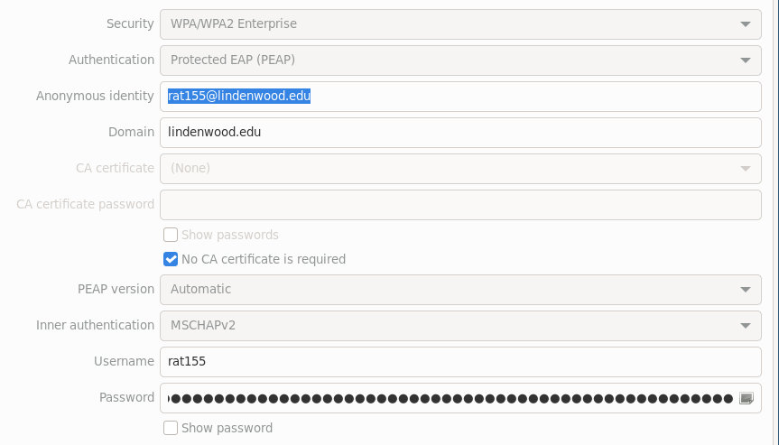

I congradulate you for making it this far.
If you are the few poor Linux users at Lindenwood, I salute you.
If you are a job recruiter looking through my Github, thank you.
  - I have set up an email alias for cool people. :)
  - cool-people.rifling638@passmail.net

# Overview

I thought I was going to back to school for finance. How wrong was I.

I showed up at least three times to IT offices before the single IT Security guy
was on his phone when I walked into the dead hallway. I asked him to help me out and he
says "I don't know anything about connecting on Linux". Story ends with this guy
calling the single current network engineer to look at old documents from the previous
network engineer, him finding instructions, and relaying it over the phone for me.

## Picture :)

If you need help with this one, you may need to look it up! :devil:

# Concluding remarks

I might just post pictures
